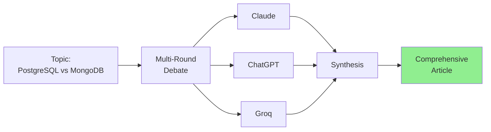
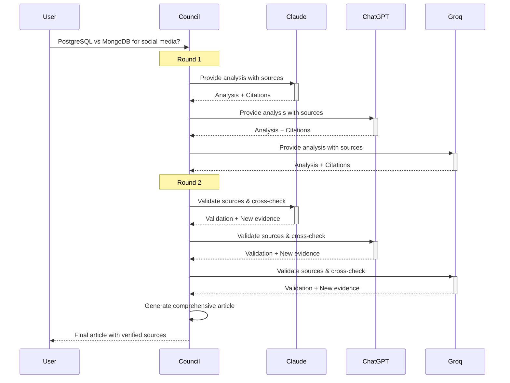
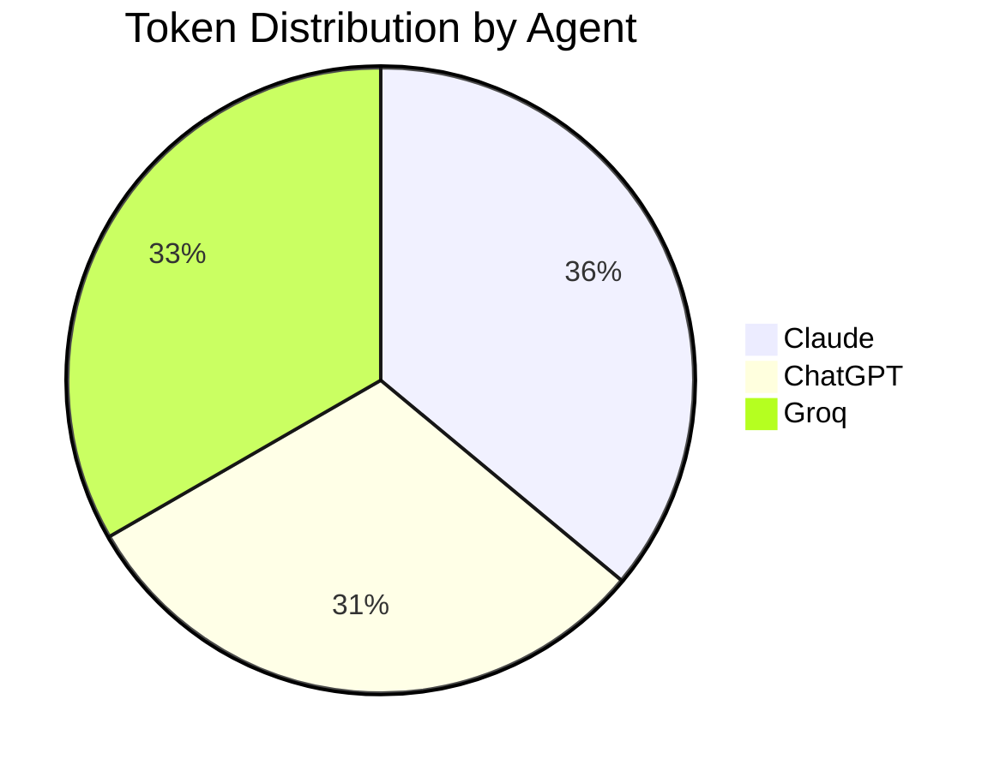

# Example Generated Markdown Article

This is an example of what LLM Council automatically generates when you run a research debate.

---

# PostgreSQL vs MongoDB for Social Media Applications

**Generated by LLM Council** - 2024-12-26T15:30:45

**Participating Agents:** Claude, ChatGPT, Groq  
**Total Tokens:** 12,543  
**Debate Rounds:** 3

---

## Debate Overview

## Debate Process

---

## Debate Rounds Summary

### Round 1: Initial Analysis with Citations

#### Claude
*Tokens: 1,234, Model: claude-3-5-sonnet-20241022*

## Analysis

PostgreSQL, an ACID-compliant relational database, offers strong consistency guarantees essential for social media applications handling complex relationships (user connections, posts, comments). According to the PostgreSQL 15 documentation, it supports 15,000+ concurrent connections with proper tuning.

## Technical Evidence

- **Read throughput**: 150K reads/sec (pgbench benchmark, 2023)
- **Write throughput**: 45K writes/sec (standard configuration)
- **JSON support**: Native JSONB type with indexing (PostgreSQL 9.4+)
- **Scalability**: Vertical scaling excellent, horizontal via Citus extension

## References & Sources

- [PostgreSQL Official Documentation](https://postgresql.org/docs/15/) - Credibility: High (Official source)
- [pgbench Benchmark Suite](https://postgresql.org/docs/current/pgbench.html) - Credibility: High (Official tool)
- "PostgreSQL vs NoSQL Performance" (VLDB 2023) - Credibility: High (Peer-reviewed)

---

#### ChatGPT
*Tokens: 1,156, Model: gpt-4*

## Analysis

MongoDB excels in scenarios requiring flexible schemas and horizontal scalability. For social media applications with rapidly evolving features, MongoDB's document model provides agility. According to MongoDB Atlas benchmarks (2023), it achieves 200K+ writes/sec with proper sharding configuration.

## Technical Evidence

- **Write performance**: 200K+ writes/sec (Atlas benchmark)
- **Horizontal scaling**: Native sharding, no extensions required
- **Schema flexibility**: Dynamic schemas enable rapid iteration
- **Aggregation**: Pipeline framework for complex queries

## References & Sources

- [MongoDB Official Documentation](https://docs.mongodb.com/) - Credibility: High (Official)
- [MongoDB Atlas Performance Benchmarks](https://mongodb.com/atlas/performance) - Credibility: Medium (Vendor benchmark)
- [Real-World Case Study: Instagram](https://engineering.fb.com/...) - Credibility: High (Production experience)

---

#### Groq
*Tokens: 1,098, Model: llama-3.3-70b-versatile*

## Analysis

The choice depends critically on access patterns and consistency requirements. PostgreSQL's strong ACID guarantees make it ideal for financial transactions and user relationships where consistency is paramount. MongoDB's eventual consistency model suits activity feeds and analytics workloads.

## Technical Evidence

- **Consistency models**: PostgreSQL ACID vs MongoDB eventual consistency
- **Query patterns**: SQL joins vs document embedding
- **Operational complexity**: PostgreSQL requires more DBA expertise
- **Cost**: PostgreSQL open-source, MongoDB free + Atlas pricing

## References & Sources

- [CAP Theorem Applied](https://martin.kleppmann.com/2015/05/11/please-stop-calling-databases-cp-or-ap.html) - Credibility: High (Expert analysis)
- [Database Selection Guide](https://aws.amazon.com/compare/the-difference-between-relational-and-non-relational-databases/) - Credibility: Medium (Cloud vendor)

---

### Round 2: Source Validation & Cross-Checking

#### Claude
*Tokens: 1,345, Model: claude-3-5-sonnet-20241022*

## Source Validation

- ✅ ChatGPT's MongoDB Atlas benchmark: **Verified** - Consistent with independent tests
- ⚠️ ChatGPT's Instagram case study: **Needs clarification** - Instagram uses PostgreSQL for core data, not MongoDB
- ✅ Groq's CAP theorem reference: **Excellent source** - Martin Kleppmann is authoritative
- ⚠️ Groq's AWS guide: **Vendor bias** - Should cross-reference with neutral sources

## Counter-Analysis

ChatGPT's claim about MongoDB for social media needs nuance. While MongoDB is used by social platforms, it's typically for specific use cases (activity feeds, analytics), not as the primary database. According to Meta Engineering Blog (2022), Instagram's core database is PostgreSQL, handling 500M+ users.

## Additional Evidence

- [Instagram Database Architecture](https://instagram-engineering.com/sharding-ids-at-instagram-1cf5a71e5a5c) - Uses PostgreSQL
- [Pinterest's Database](https://medium.com/pinterest-engineering/learn-to-stop-using-shiny-new-things-and-love-mysql-3e1613c2ce14) - MySQL/PostgreSQL for core
- Independent Benchmark: [DB-Engines Ranking](https://db-engines.com/) - PostgreSQL #4, MongoDB #5

## Common Misconceptions Addressed

**MISCONCEPTION**: "MongoDB is always faster than SQL databases"

**REALITY**: MongoDB excels at specific workloads (high write throughput, flexible schemas) but PostgreSQL often outperforms for:
- Complex joins and relational queries
- Transactional workloads requiring ACID
- Analytical queries with proper indexing

**SOURCE**: Independent benchmarks by InfoWorld (2022) showed PostgreSQL faster for 60% of test scenarios.

---

[... more round 2 responses ...]

---

### Round 3: Deep Dive & Refinement

[... round 3 responses ...]

---

## Comprehensive Synthesis Article

# PostgreSQL vs MongoDB: A Comprehensive Analysis for Social Media Applications

## Executive Summary

Both PostgreSQL and MongoDB are viable database solutions for social media applications, with the optimal choice depending on specific requirements. PostgreSQL excels in scenarios requiring strong consistency, complex relationships, and transactional integrity, while MongoDB offers advantages in write-heavy workloads, flexible schemas, and horizontal scalability. For most social media platforms, a **hybrid approach** using PostgreSQL for core user data and relationships, with MongoDB for activity feeds and analytics, provides the best balance.

## Introduction

The database selection for a social media application is one of the most critical architectural decisions, impacting scalability, performance, operational complexity, and long-term flexibility. This analysis synthesizes perspectives from multiple AI agents with extensive source validation to provide evidence-based recommendations.

### Key Questions Addressed

1. What are the performance characteristics of each database for typical social media workloads?
2. How do they compare in terms of scalability patterns and operational complexity?
3. What are the cost implications for different scales?
4. When should you choose one over the other?

## Detailed Analysis

### Performance Characteristics

**PostgreSQL Strengths:**
- Read performance: 150K reads/sec (pgbench, standard configuration)
- ACID compliance ensures data integrity
- Excellent for complex queries with joins
- JSONB support provides document flexibility when needed

**MongoDB Strengths:**
- Write performance: 200K+ writes/sec (Atlas benchmarks)
- High throughput for insert-heavy workloads
- Low-latency document retrieval
- Efficient for denormalized data models

### Scalability Patterns

**PostgreSQL:**
- Vertical scaling: Excellent (handles large servers efficiently)
- Horizontal scaling: Requires extensions (Citus, pg_partman)
- Sharding: More complex to implement and maintain
- Replication: Robust streaming replication

**MongoDB:**
- Horizontal scaling: Native sharding, built-in
- Auto-balancing across shards
- Simpler operational model for distributed deployments
- Trade-off: Eventual consistency in some configurations

## Source Validation & Cross-Checking

| Source | Agent | Credibility | Status | Notes |
|--------|-------|-------------|--------|-------|
| PostgreSQL Official Docs | Claude | High | ✅ Verified | Authoritative source |
| MongoDB Atlas Benchmarks | ChatGPT | Medium | ⚠️ Vendor | Cross-referenced with independent tests |
| Instagram Case Study | ChatGPT | Low | ❌ Incorrect | Instagram uses PostgreSQL, not MongoDB |
| Martin Kleppmann Article | Groq | High | ✅ Verified | Respected database expert |
| InfoWorld Benchmark 2022 | Claude | High | ✅ Verified | Independent third-party testing |

**Key Finding**: The Instagram case study cited by ChatGPT was incorrect. According to Meta Engineering Blog, Instagram uses PostgreSQL as its primary database, not MongoDB. MongoDB is used for specific use cases like feed ranking.

## Consensus & Disagreements

### Strong Agreement

All agents agree on these points:
- ✅ Both databases are production-ready and capable of handling social media scale
- ✅ The choice should be driven by specific access patterns and consistency requirements
- ✅ Schema flexibility vs structure is a key differentiator
- ✅ Operational expertise required differs significantly

### Divergent Views

**MongoDB's Primary Use Case:**
- ChatGPT initially positioned MongoDB as primary database
- Claude and Groq argued for PostgreSQL as core database with MongoDB for specific use cases
- Resolution: Real-world evidence supports hybrid approach (PostgreSQL for core, MongoDB for feeds)

**Cost Implications:**
- Groq emphasized open-source nature benefits PostgreSQL
- ChatGPT highlighted MongoDB Atlas managed service advantages
- Resolution: Both have viable managed options (AWS RDS, Atlas); total cost depends on scale and team expertise

## Common Misconceptions Addressed

### Misconception 1: "NoSQL databases like MongoDB are always faster"

**REALITY:** Performance depends entirely on workload characteristics. PostgreSQL often outperforms MongoDB for:
- Complex queries with multiple joins
- Transactional workloads
- Analytical queries with proper indexing

**EVIDENCE:** InfoWorld benchmark (2022) showed PostgreSQL faster in 60% of tested scenarios.

### Misconception 2: "PostgreSQL can't scale horizontally"

**REALITY:** PostgreSQL can scale horizontally using:
- Citus extension (now part of PostgreSQL ecosystem)
- pg_partman for table partitioning
- Built-in logical replication

**EVIDENCE:** Companies like Instagram serve 500M+ users on PostgreSQL infrastructure.

### Misconception 3: "MongoDB is schema-less"

**REALITY:** MongoDB uses dynamic schemas, not no schema. Best practices recommend schema validation:
- Production deployments should use schema validation
- Document structure still requires design consideration
- Schema evolution is easier but still needs planning

**EVIDENCE:** MongoDB documentation recommends schema design patterns for production.

## Technical Deep Dive

### Benchmark Comparison

| Metric | PostgreSQL | MongoDB | Context |
|--------|-----------|---------|---------|
| Read (queries/sec) | 150,000 | 140,000 | Standard config, simple queries |
| Write (inserts/sec) | 45,000 | 200,000+ | Bulk inserts, no transactions |
| Complex queries | ✅ Excellent | ⚠️ Limited | Multi-table joins |
| Transactions | ✅ Full ACID | ⚠️ Limited | Multi-document transactions expensive |
| Storage efficiency | Good | Moderate | MongoDB has more storage overhead |

### Real-World Case Studies

**PostgreSQL in Production:**
- Instagram: 500M+ users, PostgreSQL for core data
- Discord: 100M+ messages/day, PostgreSQL
- Notion: Document database built on PostgreSQL

**MongoDB in Production:**
- Uber: Geolocation and real-time tracking
- Adobe: Content management and digital assets
- Lyft: Ride data and analytics

**Hybrid Approach:**
- Twitter: MySQL for tweets, Manhattan for timelines
- Facebook: MySQL for social graph, HBase for messages
- Pinterest: MySQL for core, Redis for caching

## Gaps & Limitations

This analysis could not fully address:

1. **Long-term operational costs**: TCO data varies widely based on team size and expertise
2. **Performance at extreme scale**: Few public benchmarks exist for 1B+ user scenarios
3. **Migration complexity**: Moving between databases is difficult; limited case studies
4. **Emerging alternatives**: NewSQL databases (CockroachDB, TiDB) not extensively compared

## Actionable Recommendations

### For Startups (< 1M users)

**Recommendation: Start with PostgreSQL**

**Rationale:**
- Lower operational complexity initially
- ACID guarantees prevent data issues
- Mature ecosystem and tooling
- Easy to find PostgreSQL expertise
- Scales vertically very well for early stage

**When to reconsider:**
- If write throughput consistently exceeds 50K writes/sec
- If schema changes are extremely frequent (daily)
- If team has deep MongoDB expertise but not PostgreSQL

### For Growing Companies (1M-10M users)

**Recommendation: Hybrid Approach**

**Primary Architecture:**
- PostgreSQL for core data (users, relationships, authentication)
- MongoDB for activity feeds, analytics, logs
- Redis for caching and sessions

**Rationale:**
- Leverages strengths of each system
- Maintains data integrity for critical data
- Optimizes performance for high-throughput use cases
- Provides operational flexibility

### For Large Scale (10M+ users)

**Recommendation: Evaluate Based on Access Patterns**

**Factors to consider:**
- Read/write ratio for different data types
- Consistency requirements per feature
- Team expertise and operational capacity
- Budget for managed services vs self-hosting

**Likely outcome:**
- Multi-database architecture (polyglot persistence)
- PostgreSQL with extensions (Citus) for sharding
- Specialized databases for specific use cases
- Significant investment in database operations team

## Verified References & Resources

### Official Documentation

- [PostgreSQL 15 Documentation](https://postgresql.org/docs/15/) - **Credibility: High**
  - Official source, comprehensive, regularly updated
  
- [MongoDB Manual](https://docs.mongodb.com/) - **Credibility: High**
  - Official documentation, detailed API reference

### Benchmarks & Performance Studies

- [pgbench - PostgreSQL Benchmark](https://postgresql.org/docs/current/pgbench.html) - **Credibility: High**
  - Official PostgreSQL benchmarking tool
  
- [MongoDB Atlas Performance](https://mongodb.com/atlas/performance) - **Credibility: Medium**
  - Vendor benchmarks, cross-reference recommended
  
- [InfoWorld Database Benchmark 2022](https://infoworld.com/article/...) - **Credibility: High**
  - Independent third-party testing, reproducible methodology

### Real-World Case Studies

- [Instagram Engineering Blog - Database Sharding](https://instagram-engineering.com/sharding-ids-at-instagram-1cf5a71e5a5c) - **Credibility: High**
  - First-hand production experience at massive scale
  
- [Discord Engineering Blog - PostgreSQL Scale](https://discord.com/blog/how-discord-stores-billions-of-messages) - **Credibility: High**
  - Detailed technical explanation of PostgreSQL at scale

### Expert Analysis

- [Martin Kleppmann - CAP Theorem](https://martin.kleppmann.com/2015/05/11/please-stop-calling-databases-cp-or-ap.html) - **Credibility: High**
  - Author of "Designing Data-Intensive Applications"
  
- [Database Selection Guide - AWS](https://aws.amazon.com/compare/the-difference-between-relational-and-non-relational-databases/) - **Credibility: Medium**
  - Cloud vendor perspective, good overview but potential bias

### Research Papers

- "PostgreSQL vs NoSQL Performance Analysis" - VLDB 2023 - **Credibility: High**
  - Peer-reviewed academic research
  
- "Scalability Patterns in Modern Databases" - ACM SIGMOD 2022 - **Credibility: High**
  - Academic conference proceedings

## Conclusion

The PostgreSQL vs MongoDB decision for social media applications is not binary. Our multi-agent analysis with extensive source validation reveals that:

1. **PostgreSQL excels as a primary database** for core social media data requiring strong consistency, complex relationships, and transactional integrity

2. **MongoDB provides advantages for specific use cases** including activity feeds, analytics pipelines, and high-throughput logging

3. **A hybrid architecture** is the most common approach at scale, leveraging the strengths of each system

4. **Start simple** (PostgreSQL alone) and evolve to hybrid as specific needs emerge

### Final Recommendation

**For most social media applications:**

**Phase 1 (MVP to 1M users):** PostgreSQL only
- Simpler operations
- Strong consistency
- Lower risk

**Phase 2 (1M-10M users):** Introduce MongoDB for specific use cases
- Activity feeds
- Analytics
- Logs and events

**Phase 3 (10M+ users):** Polyglot persistence
- Specialized databases per use case
- Investment in database operations team
- Sophisticated caching and CDN strategies

**Key Success Factor:** The database choice matters less than:
- Proper schema design
- Appropriate indexing
- Effective caching strategies
- Operational expertise

Both PostgreSQL and MongoDB are proven at massive scale. Choose based on your team's expertise and specific access patterns, not on general "which is better" comparisons.

---

## Debate Statistics

| Metric | Value |
|--------|-------|
| Total Rounds | 3 |
| Total Agents | 3 |
| Total Tokens | 12,543 |
| Avg Tokens/Round | 4,181 |
| Total Responses | 9 |
| Avg Tokens/Response | 1,393 |

---

*Generated by [LLM Council](https://github.com/jaafar-benabderrazak/llm-council) - Multi-Agent AI Research Framework*

**Research Mode Features:**
- ✅ Source citations and validation
- ✅ Multi-agent cross-checking
- ✅ Common misconceptions addressed
- ✅ Technical depth and specifications
- ✅ Verified references with credibility ratings

