# The Journey of Building LLM Council: A Multi-Agent AI Story

*How a simple question evolved into a sophisticated framework that brings AI models together to debate, challenge, and synthesize the best answers*

---

## The Beginning: A Question That Started It All

"Can we use different LLMs to discuss and challenge each other on a subject?"

That's where this journey began. Not with a grand vision, but with curiosity about what happens when you let AI models debate like a council of experts.

Think about it: when you face a complex decision, you don't just ask one person. You gather diverse opinions, let people challenge each other's assumptions, and synthesize the best insights. Why shouldn't AI work the same way?

And so, LLM Council was born.

---

## Chapter 1: The Vision Takes Shape

The idea was simple but powerful: create a system where multiple AI models could:
- Present their unique perspectives
- Challenge each other's arguments
- Build on strong points
- Iterate through multiple rounds
- Synthesize a comprehensive answer

```mermaid
graph LR
    A[Single AI<br/>❌ One Perspective] --> C[Problem]
    B[LLM Council<br/>✅ Multiple Perspectives] --> D[Solution]
    
    C -->|Limited viewpoint| E[Blind spots]
    C -->|No challenges| F[Unchecked assumptions]
    
    D -->|Diverse analysis| G[Comprehensive]
    D -->|Peer review| H[Validated insights]
    
    style A fill:#ffcccc
    style B fill:#ccffcc
```



But turning this idea into reality? That was the real adventure.

---

## Chapter 2: Laying the Foundation

Every good building needs a solid foundation. For LLM Council, this meant designing an architecture that could:
- Support multiple AI providers
- Scale easily as new models emerge
- Handle errors gracefully
- Keep code maintainable

The architecture evolved into three clear layers:

```mermaid
graph TB
    subgraph "The User's World"
        A[💬 CLI: Quick commands]
        B[🐍 Python API: Full control]
    end
    
    subgraph "The Orchestrator"
        C[🎭 LLMCouncil<br/>The Debate Master]
        D[⚙️ Config<br/>The Rule Keeper]
    end
    
    subgraph "The Agents"
        E[🎯 BaseAgent<br/>The Blueprint]
        F[Claude<br/>The Critic]
        G[ChatGPT<br/>The Pragmatist]
        H[Gemini<br/>The Researcher]
        I[Mistral<br/>The Challenger]
    end
    
    subgraph "The World"
        J[☁️ Anthropic]
        K[☁️ OpenAI]
        L[☁️ Google]
        M[☁️ Mistral AI]
    end
    
    A --> C
    B --> C
    C --> E
    E --> F
    E --> G
    E --> H
    E --> I
    F --> J
    G --> K
    H --> L
    I --> M
    
    style C fill:#ffd700
    style E fill:#87ceeb
```



Each agent would have a personality - a role to play in the debate. Claude became the critical analyst, questioning assumptions. ChatGPT took on the pragmatic problem-solver role. Gemini became the research synthesizer, and Mistral? The devil's advocate, always challenging consensus.

---

## Chapter 3: The First Debate

With the foundation in place, it was time for the first test. The system needed to:

1. Accept a topic
2. Let each agent respond
3. Share those responses with the next round
4. Repeat for multiple rounds
5. Synthesize everything into a final answer

Here's how the conversation flows:

```mermaid
sequenceDiagram
    participant User
    participant Council as LLM Council
    participant Agent1 as Claude
    participant Agent2 as ChatGPT
    participant Synth as Synthesizer
    
    User->>Council: "Should we use microservices?"
    
    Note over Council: Round 1: Fresh Perspectives
    Council->>Agent1: What do you think?
    Agent1-->>Council: "Consider the complexity costs..."
    
    Council->>Agent2: Here's what Claude said. Your thoughts?
    Agent2-->>Council: "Actually, for small teams, monoliths are..."
    
    Note over Council: Round 2: The Debate Deepens
    Council->>Agent1: Claude, ChatGPT challenges your point
    Agent1-->>Council: "Valid concern, but at scale..."
    
    Council->>Agent2: ChatGPT, Claude responded
    Agent2-->>Council: "Fair point. However..."
    
    Note over Council: Synthesis: Bringing It Together
    Council->>Synth: Here are all perspectives
    Synth-->>Council: "Balanced conclusion..."
    
    Council-->>User: 📊 Here's your comprehensive answer
```



The first debate was messy. Agents talked past each other. Context wasn't preserved properly. But it *worked* - and that was the breakthrough moment.

---

## Chapter 4: Adding Intelligence to the Chaos

Getting agents to respond was one thing. Getting them to actually *debate* was another.

The key insight? **Context is everything.**

Each agent needed to see not just the question, but what others had said. So we built a context management system:


Suddenly, agents weren't just answering questions - they were having real discussions. Claude would challenge an assumption, ChatGPT would defend with practical examples, and Mistral would find holes in both arguments.

Magic was happening.

---

## Chapter 5: The "Anyone Can Use This" Moment

Then came the reality check: "This is cool, but I can't afford four different AI subscriptions."

Fair point.

So began the mission to make LLM Council accessible to everyone. Enter the free tier revolution:


Three new agents joined the council:

**Ollama** - The local hero. Runs entirely on your machine. Free forever. Perfect for privacy-conscious users.

**Groq** - The speed demon. Free cloud API with blazing fast inference (500+ tokens/second!). Generous limits.

**HuggingFace** - The community champion. Access to thousands of open-source models. Free tier available.

Now anyone could run sophisticated multi-agent debates for exactly zero dollars.

---

## Chapter 6: Battle-Testing in the Real World

Theory meets reality. Time to deploy.

First challenge: **Python 3.13** users were getting cryptic errors about Rust compilers.


**Solution:** Update to newer package versions with pre-built wheels. One line change, problem solved.

Second challenge: **Windows console encoding**. Emojis and special characters were crashing the program.

```mermaid
flowchart TD
    A[Unicode chars: 🏛️ ═══ ✓] --> B{Windows?}
    B -->|Yes| C[💥 UnicodeEncodeError]
    B -->|No| D[✅ Fine]
    
    C --> E[The Fix]
    E --> F[Remove emojis]
    E --> G[Use ASCII alternatives]
    E --> H[Configure Rich console]
    
    F --> I["=== not ═══"]
    G --> I
    H --> I[legacy_windows=False]
    
    I --> J[✅ Windows compatible]
    
    style C fill:#ffcccc
    style J fill:#ccffcc
```



**Solution:** Replace Unicode characters with ASCII alternatives, configure the Rich library properly for Windows. Tested. Works.

Third challenge: **Model deprecation**. Mid-development, Groq deprecated their `llama3-70b-8192` model.

```mermaid
sequenceDiagram
    participant U as User
    participant S as System
    participant G as Groq
    
    U->>S: Use llama3-70b-8192
    S->>G: API call
    G-->>S: ❌ Error: Model decommissioned
    
    Note over S: Graceful handling
    S->>S: Catch exception
    S->>S: Return error response
    S->>U: "Model unavailable, continuing..."
    
    Note over U,G: Updated config
    U->>S: Use llama-3.3-70b-versatile
    S->>G: API call
    G-->>S: ✅ Success!
    S-->>U: Response
```



**Solution:** Graceful error handling, clear messages, easy configuration updates. The show must go on.

---

## Chapter 7: The Orchestration Dance

By now, the system was robust. But how does a debate actually happen? Let's peek behind the curtain:


Each debate follows this choreography:
1. Agents speak in sequence (preserving context)
2. Later agents see earlier arguments
3. Multiple rounds deepen the analysis
4. Synthesis brings it all together

The result? Not just answers, but *insights*.

---

## Chapter 8: Making It Beautiful

A powerful engine deserves a beautiful interface. Enter the Rich library:

```mermaid
graph LR
    A[Raw Text] --> B[Rich Library]
    
    B --> C[📊 Panels<br/>for responses]
    B --> D[🎨 Colors<br/>by agent]
    B --> E[⚡ Progress<br/>indicators]
    B --> F[📝 Markdown<br/>formatting]
    
    C --> G[Beautiful<br/>Terminal UI]
    D --> G
    E --> G
    F --> G
    
    style A fill:#cccccc
    style G fill:#ffd700
```



The terminal came alive:
- **Colorful panels** for each agent's response
- **Progress indicators** while AI thinks
- **Markdown rendering** for formatted text
- **Clear visual hierarchy** for easy reading

Debugging output became a presentation. Users loved it.

---

## Chapter 9: Documentation as First-Class Code

Good code deserves great documentation. But this project went further - documentation became part of the product:


Thirteen documentation files. Multiple learning paths. Something for everyone:
- **Beginners** get `GET_STARTED.md` - up and running in 3 minutes
- **Developers** get `USAGE_GUIDE.md` - every feature explained
- **Architects** get `TECHNICAL_ARTICLE.md` - full system design
- **Budget-conscious** get `FREE_TIER_GUIDE.md` - zero-cost options

Documentation wasn't an afterthought. It was the welcome mat.

---

## Chapter 10: The Free Tier Strategy

Making the system truly accessible meant more than just code - it meant strategy:

```mermaid
graph TB
    subgraph "The Free Path"
        A[🏠 Ollama<br/>Local & Private]
        B[⚡ Groq<br/>Fast & Free]
        C[🌐 HuggingFace<br/>Open Source]
    end
    
    subgraph "The Premium Path"
        D[🎯 Claude<br/>Top Quality]
        E[🤖 ChatGPT<br/>Most Popular]
        F[💎 Gemini<br/>Google Power]
    end
    
    G[Student<br/>Zero Budget] --> A
    G --> B
    
    H[Startup<br/>Testing] --> B
    H --> C
    
    I[Professional<br/>Production] --> D
    I --> E
    I --> F
    
    J[Hybrid<br/>Cost Optimized] --> A
    J --> B
    J --> D
    
    style A fill:#90EE90
    style B fill:#90EE90
    style C fill:#90EE90
    style D fill:#FFD700
    style E fill:#FFD700
    style F fill:#FFD700
```



Three tiers emerged:
- **Free Everything**: Ollama + Groq + HuggingFace
- **Free Premium Mix**: Free models + one paid for critical tasks
- **Full Premium**: All paid models for maximum quality

Start free, scale as needed. No barriers to entry.

---

## Chapter 11: The Architecture Reveals Itself

After all the iterations and improvements, the architecture crystallized into something elegant:


Seven providers. One interface. Infinite possibilities.

---

## Chapter 12: Real-World Usage Patterns

As users adopted LLM Council, patterns emerged:


**Quick Questions** (1 round):
- "Top 3 technologies for X"
- "Quick pros/cons analysis"
- "Sanity check my approach"

**Standard Debates** (2-3 rounds):
- Product decisions
- Architecture choices
- Strategy planning

**Deep Analysis** (4-5 rounds):
- Research papers
- Complex technical decisions
- Thorough investigation

**Research Projects** (5+ rounds):
- Academic work
- Comprehensive reports
- Multi-faceted analysis

Each use case found its sweet spot.

---

## Chapter 13: The Synthesis Algorithm

The crown jewel of LLM Council isn't just the debate - it's what comes after. The synthesis:

```mermaid
flowchart TB
    A[All Round Responses] --> B{Analysis Phase}
    
    B --> C[Scan for Agreements]
    B --> D[Identify Conflicts]
    B --> E[Rate Arguments]
    B --> F[Find Gaps]
    
    C --> G[Common Ground:<br/>What everyone agrees on]
    D --> H[Divergent Views:<br/>Where opinions split]
    E --> I[Strong Points:<br/>Best arguments]
    F --> J[Missing Pieces:<br/>What needs more research]
    
    G --> K{Synthesis Engine}
    H --> K
    I --> K
    J --> K
    
    K --> L[Balanced Conclusion]
    K --> M[Actionable Insights]
    K --> N[Research Directions]
    
    L --> O[Final Synthesis]
    M --> O
    N --> O
    
    O --> P[📊 Comprehensive Answer]
    
    style P fill:#ffd700
```



The synthesis doesn't just summarize - it understands:
- Where do all agents agree? (High confidence)
- Where do they disagree? (Consider both sides)
- What arguments are strongest? (Evidence-based)
- What's missing? (Areas for deeper investigation)

The result? Not just an answer, but a *meta-analysis* of multiple AI perspectives.

---

## Chapter 14: Performance Characteristics

Different models bring different strengths:


**The Free Zone** (bottom-left):
- Ollama: Free, local, private
- Groq: Free, fast, good quality
- HuggingFace: Free, variable quality

**The Sweet Spot** (top-middle):
- Gemini: Free tier + premium options
- Mistral: Affordable, solid quality

**The Premium Zone** (top-right):
- ChatGPT: Industry standard
- Claude: Top-tier reasoning

Mix and match based on needs. Start free, scale up when justified.

---

## Chapter 15: The Development Timeline

From idea to production in two days:

```mermaid
gantt
    title Building LLM Council: A Two-Day Journey
    dateFormat HH:mm
    section Day 1: Foundation
    Project Vision & Planning     :00:00, 1h
    Base Architecture             :01:00, 2h
    First Agent (Claude)          :03:00, 1h
    Multi-Agent System            :04:00, 2h
    Debate Orchestration          :06:00, 3h
    Initial Testing               :09:00, 1h
    
    section Day 1: Documentation
    README & Quick Start          :10:00, 2h
    Usage Examples                :12:00, 2h
    Resource Collection           :14:00, 1h
    
    section Day 2: Enhancement
    Free Tier Research            :00:00, 1h
    Ollama Integration            :01:00, 2h
    Groq Integration              :03:00, 1h
    HuggingFace Integration       :04:00, 1h
    Free Tier Documentation       :05:00, 2h
    
    section Day 2: Polish
    Windows Compatibility         :07:00, 2h
    Error Handling                :09:00, 1h
    Final Testing                 :10:00, 2h
    Technical Article             :12:00, 2h
    Git & GitHub Setup            :14:00, 1h
```



Two intense days. Countless iterations. One powerful framework.

---

## Chapter 16: Lessons Learned

Building LLM Council taught valuable lessons:


**Key Insights:**

1. **Accessibility First**: Free tier made it usable by everyone
2. **Documentation is Love**: 13 guides showed we cared
3. **Graceful Degradation**: Works with any combination of models
4. **Platform Matters**: Windows compatibility was crucial
5. **Iterate Quickly**: Two days of focused development beat months of planning

---

## Chapter 17: The Impact

What started as an experiment became something more:


The framework enabled:
- **Students** to learn AI without budget barriers
- **Startups** to prototype before investing
- **Researchers** to explore multi-agent systems
- **Developers** to build on a solid foundation

Not just code - an **enabler of possibilities**.

---

## Chapter 18: The Architecture in Action

Watch a real debate unfold:


This is what makes LLM Council special - not just answers, but *reasoning*.

---

## Chapter 19: The Extension Points

The architecture was designed for growth:

```mermaid
graph TB
    subgraph "Current State"
        A[7 LLM Providers]
        B[CLI Interface]
        C[Python API]
    end
    
    subgraph "Easy to Add"
        D[New LLM Provider<br/>Extend BaseAgent]
        E[Web Interface<br/>Gradio/Streamlit]
        F[REST API<br/>FastAPI server]
    end
    
    subgraph "Planned Features"
        G[Streaming Responses<br/>Real-time updates]
        H[Voting System<br/>Best argument selection]
        I[Visualization<br/>Debate flow diagrams]
    end
    
    subgraph "Community Ideas"
        J[Discord Bot<br/>Team debates]
        K[Slack Integration<br/>Decision support]
        L[GitHub Actions<br/>PR analysis]
    end
    
    A --> D
    B --> E
    C --> F
    
    D --> G
    E --> H
    F --> I
    
    G --> J
    H --> K
    I --> L
```

Every piece was designed to extend. The framework grew not despite its architecture, but because of it.

---

## Chapter 20: The Numbers Tell a Story

After everything was built:

```mermaid
graph LR
    A[📊 Project Stats] --> B[🗂️ Files: 42]
    A --> C[📝 Lines: 7,872+]
    A --> D[🤖 Agents: 7]
    A --> E[📚 Docs: 13]
    A --> F[💡 Examples: 8]
    
    B --> G[Impact]
    C --> G
    D --> G
    E --> G
    F --> G
    
    G --> H[🌟 Comprehensive<br/>Framework]
    G --> I[🆓 Free Tier<br/>Available]
    G --> J[📖 Well<br/>Documented]
    G --> K[🚀 Production<br/>Ready]
    
    style H fill:#90EE90
    style I fill:#90EE90
    style J fill:#90EE90
    style K fill:#90EE90
```

But numbers don't tell the whole story. What matters is what people can build with it.

---

## Epilogue: What We Built

LLM Council isn't just code. It's an idea realized:

**The Idea:** AI models should collaborate, not just respond.

**The Reality:** A framework where:
- Multiple AI models engage in structured debates
- Each model brings its unique perspective
- Arguments are challenged and refined
- The best insights emerge through iteration
- Everyone can use it, regardless of budget

```mermaid
graph TB
    A[🤔 Question] --> B[🏛️ LLM Council]
    
    B --> C[🎭 Multi-Agent<br/>Debate]
    C --> D[💬 Round 1:<br/>Perspectives]
    D --> E[🔄 Round 2:<br/>Challenges]
    E --> F[✨ Round 3:<br/>Refinement]
    
    F --> G[🧠 Synthesis]
    
    G --> H[✅ Agreements]
    G --> I[⚖️ Trade-offs]
    G --> J[🎯 Best Path]
    G --> K[❓ Open Questions]
    
    H --> L[📊 Comprehensive<br/>Answer]
    I --> L
    J --> L
    K --> L
    
    style L fill:#ffd700
```

---

## The Future: Where This Goes Next

The journey doesn't end here. Ideas for tomorrow:

```mermaid
timeline
    title The Road Ahead
    Phase 1 (Months 1-3) : Streaming Responses
                         : Real-time debate viewing
                         : WebSocket support
    
    Phase 2 (Months 4-6) : Web Interface
                         : Gradio/Streamlit UI
                         : Share debates publicly
    
    Phase 3 (Months 7-9) : Voting & Rating
                         : Community feedback
                         : Best argument selection
    
    Phase 4 (Months 10-12) : Integrations
                           : Discord bot
                           : Slack app
                           : GitHub Actions
    
    Phase 5 (Year 2) : Advanced Features
                     : Custom synthesis algorithms
                     : Multi-language support
                     : Visual debate flows
```

But that's a story for another time.

---

## Conclusion: The Power of Perspective

We started with a simple question: "Can different LLMs discuss and challenge each other?"

The answer? Not only *can* they - they *should*.

Because the best answers don't come from a single source. They emerge from:
- Multiple perspectives
- Rigorous challenge
- Iterative refinement
- Thoughtful synthesis

LLM Council makes this possible. For everyone. For free.

```mermaid
mindmap
    root((LLM Council))
        What It Is
            Multi-agent framework
            Debate orchestrator
            Synthesis engine
        What It Does
            Orchestrates AI debates
            Challenges assumptions
            Synthesizes insights
        Why It Matters
            Better decisions
            Diverse perspectives
            Accessible to all
        What's Next
            You decide
            Build on it
            Extend it
            Share it
```

---

## The Technical Achievement

Seven LLM integrations. Thirteen documentation files. Eight working examples. Two days of intense development. One powerful framework.

But the real achievement? **Making sophisticated AI collaboration accessible to anyone with an idea and an internet connection.**

That's the story of LLM Council.

---

## Your Turn

The code is on GitHub: https://github.com/jaafar-benabderrazak/llm-council

The journey continues. What will you build with it?

---

*Written with multiple AI perspectives, synthesized into one narrative. Meta? Perhaps. Effective? Definitely.*

**LLM Council** - Where diverse AI perspectives converge to produce the best responses.

Built with ❤️ for collaborative intelligence.

---

**End of Story**

*Technical specifications in README.md  
Implementation details in source code  
Setup instructions in FREE_TIER_GUIDE.md  
Architecture diagrams throughout this document*

