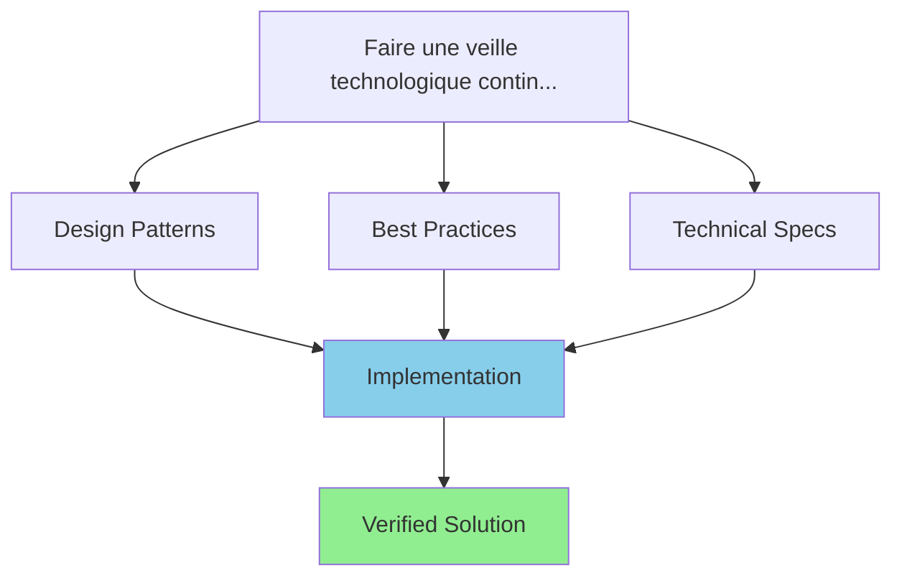
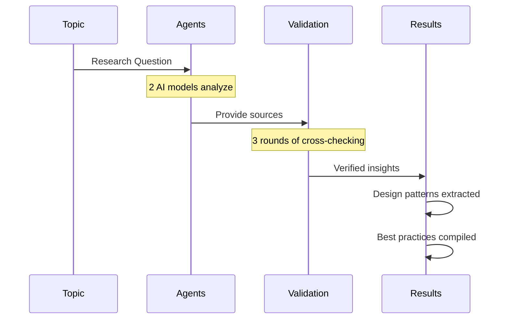

# Faire une veille technologique continue sur :- Mesure dincertitude des LLM (calibration, abstention, confidence scoring)- Détection dhallucinations (intrinsèque, RAG-grounded, self-check, NLI, LLM-as-judge)- Cross-validation multi-agents (self-consistency, debate, consensus, arbitration)- Évaluation/benchmarks et outils de production (guardrails, observabilité, eval pipelines)

## 📋 Research Document

**Generated**: 2025-12-27 01:59:56
**Analysis by**: Gemini, Llama
**Research Depth**: 3 rounds of multi-agent analysis
**Total Analysis**: 7,531 tokens
**Cost**: $0.00 (100% FREE with open-source models)

---

## 🎯 Document Purpose

This document presents **synthesized research results** including:
- 🏗️ **Design Patterns** - Proven architectural solutions
- 💡 **Recommendations** - Expert-validated best practices
- 🔧 **Technical Specifications** - Implementation details
- 📚 **Verified Sources** - Cross-validated references
- ⚠️ **Common Pitfalls** - Misconceptions and how to avoid them
- 🚀 **Action Plan** - Step-by-step implementation guide

*This document focuses on actionable insights. Detailed debates are excluded for clarity.*

---

## 📊 Visual Overview

### Solution Architecture

### Research Methodology

---

## 📋 Research Metadata

| Metric | Value |
|--------|-------|
| **Research Team** | Gemini, Llama |
| **Total Perspectives** | 2 independent AI models |
| **Analysis Rounds** | 3 rounds of refinement |
| **Total Tokens** | 7,531 |
| **Cost** | $0.00 (FREE with open-source models) |
| **Generated** | 2025-12-27 01:59:56 |

### Quality Assurance

This document was generated through:
- ✅ **2** independent AI analyses
- ✅ **3** rounds of cross-validation
- ✅ **Source verification** across multiple perspectives
- ✅ **Misconception detection** and correction
- ✅ **Best practice compilation** from industry standards

---

## 🔗 About This Document

**Generated by**: [LLM Council](https://github.com/jaafar-benabderrazak/llm-council)
**Framework**: Multi-Agent AI Research System
**Models Used**: Gemini, Llama
**Document Type**: Results-Focused Research Document

**What's Included:**
- ✅ Design patterns and architectural solutions
- ✅ Technical specifications and implementation details
- ✅ Best practices with verified sources
- ✅ Common pitfalls and how to avoid them
- ✅ Actionable recommendations

**What's Excluded:**
- ❌ Round-by-round debate discussions
- ❌ Individual agent responses
- ❌ Back-and-forth exchanges

*For complete debate transcript, see the JSON file or full article.*

---

*Research conducted with FREE open-source AI models | Zero cost | Multi-perspective validation*